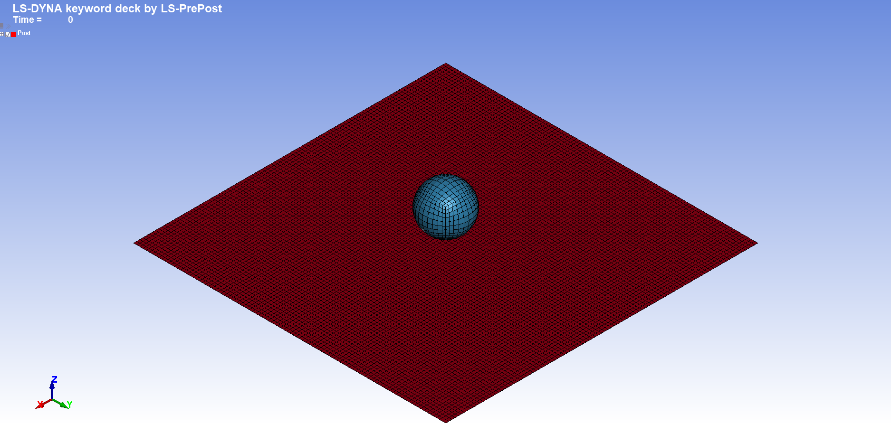
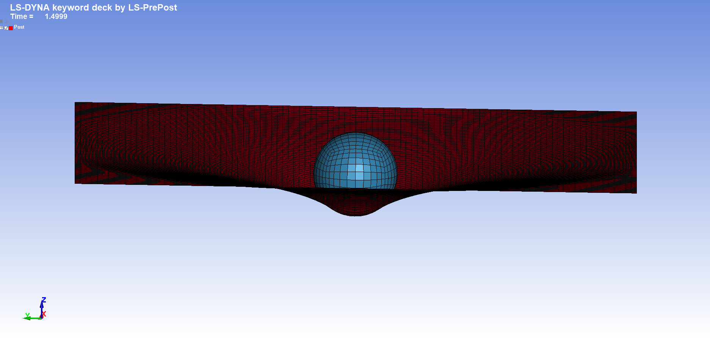
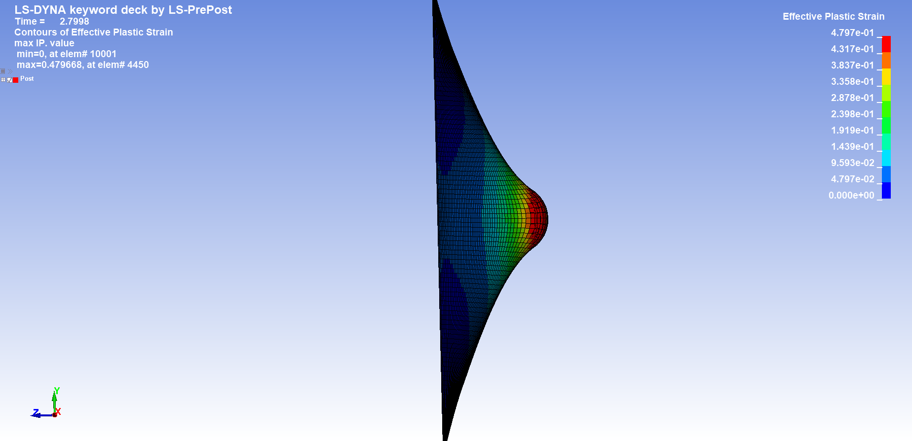
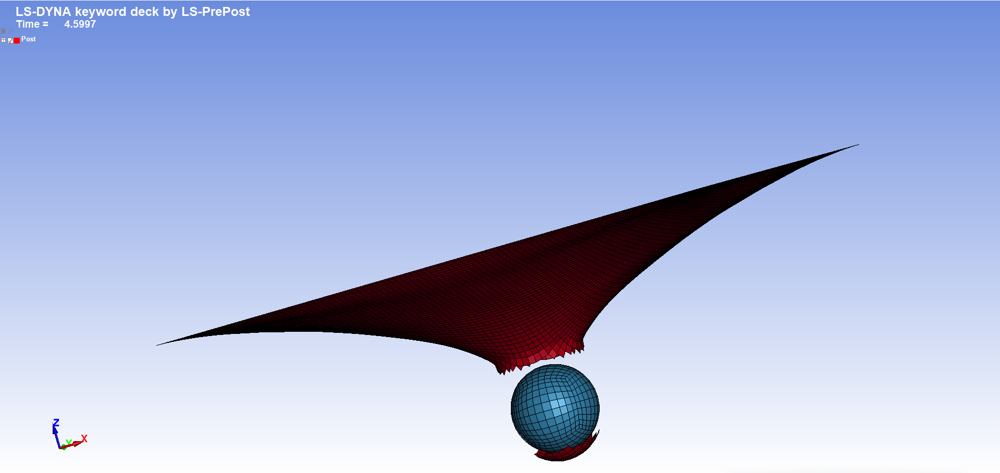
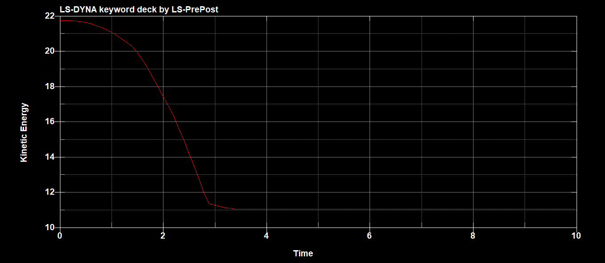
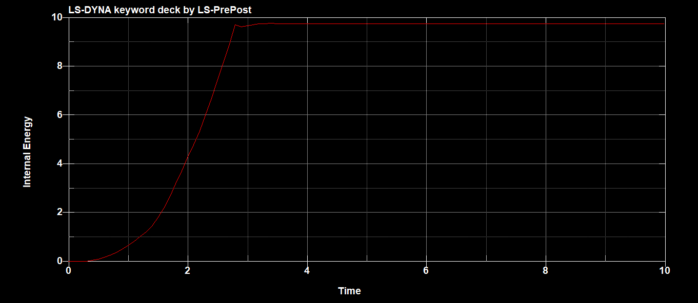
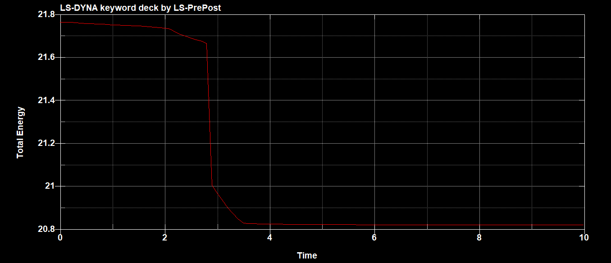

# Ball Impact on an Aluminium Plate — LS-DYNA Explicit FEM Simulation

## Project Overview

This project presents an explicit dynamic Finite Element Method (FEM) simulation of a rigid steel spherical projectile impacting a thin aluminium plate using **LS-DYNA** and **LS-PrePost**.

The main objective is to study the nonlinear response of the plate during impact, including:

- Large deformation
- Plastic deformation
- Material failure
- Element erosion
- Plate perforation
- Energy transfer during impact

An important part of the project was the troubleshooting of the failure behaviour.

The initial model reproduced severe plastic deformation of the plate but did not produce the expected perforation. The model was therefore systematically reviewed until the failure and element erosion behaviour was correctly reproduced.

---

# Software

- **LS-DYNA Student R16.1**
- **Double Precision SMP solver**
- **LS-PrePost 2025 R1**
- Git & GitHub

Analysis type:

**Explicit Dynamic Finite Element Analysis**

---

# Unit System

LS-DYNA does not impose a predefined unit system. Therefore, all model parameters must be defined using a consistent set of units.

The following consistent system is used throughout this simulation:

| Magnitude | Unit |
|---|---|
| Length | mm |
| Time | ms |
| Mass | kg |
| Velocity | mm/ms |
| Acceleration | mm/ms² |
| Force | kN |
| Stress / Pressure | GPa |
| Young's Modulus | GPa |
| Density | kg/mm³ |
| Energy | J |

An important consequence of this unit system is:

**1 mm/ms = 1 m/s**

and:

**1 kN·mm = 1 J**

Therefore, the energy values obtained from LS-DYNA and represented in the kinetic, internal and total energy histories can be directly interpreted in **joules (J)**.

---

# Model Description

The numerical model consists of two main components:

| Component | Element Type | Formulation | Number of Elements | Material |
|---|---|---:|---:|---|
| Aluminium plate | Shell | ELFORM 2 | 10,000 | MAT_POWER_LAW_PLASTICITY |
| Steel projectile | Solid | ELFORM 1 | 7,000 | MAT_RIGID |

**Total number of finite elements: 17,000**

The aluminium plate has dimensions of:

**200 × 200 mm**

with a thickness of:

**0.1 mm**

The spherical projectile has a radius of approximately:

**15 mm**

---

# Finite Element Mesh

## Aluminium Plate

The aluminium plate is discretized using:

- 10,000 shell elements
- ELFORM = 2
- 4 through-thickness integration points
- Approximate element dimensions: 2 × 2 mm
- Shell thickness: 0.1 mm

The regular mesh provides a relatively fine discretization around the impact region and allows the large deformation of the plate to be represented.

## Steel Projectile

The spherical projectile is discretized using:

- 7,000 solid elements
- ELFORM = 1

The projectile is defined as a rigid body so that the analysis primarily focuses on the deformation and failure response of the aluminium plate.

### Initial finite element model

The following image shows the initial configuration and finite element mesh before impact:



---

# Material Models

## Aluminium Plate

The aluminium plate is defined using:

`*MAT_POWER_LAW_PLASTICITY`

Main material parameters:

| Parameter | Value |
|---|---:|
| Density | 2.685 × 10⁻⁶ kg/mm³ |
| Young's Modulus | 68.95 GPa |
| Poisson's Ratio | 0.33 |
| Strength Coefficient K | 0.0974 GPa |
| Hardening Exponent n | 0.33587 |
| Failure Strain EPSF | 0.4876 |

This material model represents the nonlinear plastic response of the aluminium plate during the impact event.

---

## Steel Projectile

The projectile is modelled as a rigid body using:

`*MAT_RIGID`

Main parameters:

| Parameter | Value |
|---|---:|
| Density | 7.8 × 10⁻⁶ kg/mm³ |
| Young's Modulus | 200 GPa |
| Poisson's Ratio | 0.30 |

The rigid formulation prevents significant deformation of the projectile and allows the analysis to focus primarily on the structural response of the plate.

---

# Boundary Conditions

The external boundary of the aluminium plate is constrained using:

`*BOUNDARY_SPC_SET`

The selected boundary nodes are constrained in all translational and rotational degrees of freedom.

This represents a **fully clamped plate boundary condition**.

---

# Initial Conditions

The spherical projectile is assigned an initial velocity using:

`*INITIAL_VELOCITY_GENERATION`

The initial velocity is:

**Vz = -20 mm/ms**

Since:

**1 mm/ms = 1 m/s**

the impact velocity is equivalent to:

**Vz = -20 m/s**

The negative sign indicates that the projectile moves toward the plate in the negative Z direction.

---

# Contact Definition

The interaction between the projectile and the aluminium plate is defined using:

`*CONTACT_AUTOMATIC_SURFACE_TO_SURFACE`

The friction coefficients are:

| Parameter | Value |
|---|---:|
| Static friction coefficient | 0.20 |
| Dynamic friction coefficient | 0.10 |

This contact definition controls the interaction between the projectile and the plate during the impact event.

---

# Impact and Plate Deformation

After contact begins, the projectile transfers part of its kinetic energy to the plate.

This produces a large out-of-plane deformation concentrated around the central impact region.



The deformation propagates from the impact point toward the surrounding plate while the central region experiences the most severe deformation.

The deformed finite element mesh also provides a clear visualization of the global bending of the plate and the strongly localized response around the projectile.

---

# Effective Plastic Strain

The **Effective Plastic Strain** was analysed to evaluate the development and localization of irreversible plastic deformation.



The contour shows a strong concentration of plastic strain around the projectile/plate contact region.

Regions farther from the impact point experience progressively lower values.

Immediately before element erosion, the maximum Effective Plastic Strain approaches the failure criterion used in the model.

The erosion criterion is approximately:

**EFFEPS = 0.4876**

while the selected pre-failure result shows a maximum Effective Plastic Strain of approximately:

**0.480**

This illustrates the localization of plastic deformation immediately before the affected elements reach the prescribed erosion condition.

---

# Material Failure and Element Erosion

One of the most important learning points of this project was the implementation and troubleshooting of material failure.

In the initial simulation, the aluminium plate experienced very large plastic deformation but did not perforate as expected.

The projectile produced severe deformation, but the affected shell elements remained active instead of being removed after reaching the intended failure condition.

Several aspects of the model were systematically reviewed:

- Geometry
- Mesh
- Shell formulation
- Through-thickness integration points
- Material properties
- Failure strain
- Projectile material
- Initial velocity
- Boundary conditions
- Contact definition
- Simulation termination time
- Solver precision

An explicit erosion criterion was finally introduced using:

`*MAT_ADD_EROSION`

associated with the aluminium material.

The Effective Plastic Strain criterion was defined as:

**EFFEPS = 0.4876**

Once this condition is reached, the corresponding elements can be removed from the calculation.

The resulting simulation reproduces the perforation of the aluminium plate:



This troubleshooting process highlighted an important distinction between:

**Plastic deformation**

↓

**Material failure criterion**

↓

**Element erosion**

↓

**Visible perforation**

A material can therefore undergo very large plastic deformation without necessarily producing visible perforation if the corresponding failure and element-removal behaviour is not properly represented.

---

# Simulation Control

The explicit simulation is performed until:

**Termination time = 10 ms**

The LS-DYNA binary result database is generated using:

`*DATABASE_BINARY_D3PLOT`

with an output interval of:

**Δt = 0.1 ms**

This provides sufficient temporal resolution to analyse the evolution of the impact event.

---

# Energy Analysis

Global energy histories were analysed to evaluate the physical and numerical evolution of the system during impact.

The three main quantities considered are:

- Kinetic Energy
- Internal Energy
- Total Energy

Because the model uses the **mm-ms-kg** consistent unit system, all energy values shown below are expressed in:

**Joules (J)**

---

## Kinetic Energy



At the beginning of the simulation, most of the system energy is associated with the motion of the projectile.

The initial kinetic energy is approximately:

**Ek,initial ≈ 21.8 J**

During impact, kinetic energy decreases rapidly as the projectile transfers energy to the plate.

After the main impact event, the kinetic energy stabilizes at approximately:

**Ek,final ≈ 11.0 J**

Therefore, the approximate reduction in kinetic energy is:

**ΔEk ≈ 10.8 J**

The remaining kinetic energy is mainly associated with the continued motion of the projectile after perforation and other residual motion in the system.

---

## Internal Energy



At the beginning of the simulation:

**Ei,initial ≈ 0 J**

During impact, internal energy increases rapidly.

After the principal deformation and failure event, it reaches approximately:

**Ei,final ≈ 9.7 J**

The increase occurs during approximately the same time interval in which kinetic energy decreases.

This behaviour is consistent with the transfer of part of the projectile's kinetic energy into the structural and material response of the plate.

Internal energy should not be interpreted exclusively as plastic deformation energy. It represents the internal energetic response of the finite element system and therefore must be interpreted together with the material formulation and the other energy components.

---

# Energy Transfer During Impact

The kinetic and internal energy histories provide a clear representation of the energy transfer occurring during impact.

Initially:

**Ek ≈ 21.8 J**

and:

**Ei ≈ 0 J**

After the main impact event:

**Ek ≈ 11.0 J**

and:

**Ei ≈ 9.7 J**

Therefore:

**Ek + Ei ≈ 20.7 J**

This value is close to the total energy observed after the main impact event.

The physical evolution can be summarized as:

**Projectile kinetic energy**

↓

**Impact**

↓

**Plate deformation**

↓

**Plastic deformation**

↓

**Material failure**

↓

**Element erosion**

↓

**Perforation**

↓

**Residual projectile motion**

---

# Total Energy



The total energy provides an important global assessment of the numerical behaviour of the simulation.

Initially:

**Etotal,initial ≈ 21.75 J**

At the end of the analysed event:

**Etotal,final ≈ 20.82 J**

The approximate difference is:

**ΔEtotal ≈ 0.93 J**

which corresponds to approximately:

**4.3 %**

The main variation occurs during the impact and element erosion event.

After the principal impact process, the total energy becomes approximately stable.

Therefore, it would not be correct to state that total energy remains perfectly constant throughout the entire simulation.

Instead, the model shows an approximately **4.3 % variation in the recorded total energy during the impact/erosion process**, followed by a relatively stable post-impact response.

The total energy history should therefore be interpreted together with the kinetic and internal energy histories and with the use of element erosion in the model.

---

# Interpretation of the Impact Event

The complete numerical sequence can be summarized as follows:

1. The projectile approaches the plate with an initial velocity of 20 m/s.
2. The system initially contains approximately 21.8 J of kinetic energy.
3. Contact begins between the projectile and plate.
4. The plate develops significant out-of-plane deformation.
5. Effective Plastic Strain becomes concentrated around the impact region.
6. The local plastic strain approaches the defined erosion criterion.
7. The failure condition is reached.
8. Elements are removed from the plate.
9. Perforation develops around the projectile.
10. The projectile continues moving with residual kinetic energy.
11. Internal energy stabilizes after the main deformation event.
12. The global energy histories reach an approximately stable post-impact state.

The energy histories are therefore consistent with the visual evolution observed in the simulation.

---

# Troubleshooting and Model Development

The troubleshooting stage became an important part of this project.

The initial model reproduced impact and severe deformation but did not reproduce the expected perforation.

Potential causes were investigated systematically rather than modifying multiple parameters simultaneously.

The analysis included checking:

- Geometry
- Mesh density
- Shell element formulation
- Number of through-thickness integration points
- Material properties
- Failure strain
- Projectile definition
- Initial velocity
- Boundary conditions
- Contact
- Termination time
- Solver configuration

Increasing the simulation termination time did not produce perforation.

Reducing the failure strain alone also did not reproduce the expected behaviour.

The final working model retained:

`*MAT_POWER_LAW_PLASTICITY`

for the constitutive behaviour of the aluminium plate and incorporated:

`*MAT_ADD_EROSION`

to explicitly control element removal after the specified failure condition was reached.

This produced the expected perforation behaviour.

---

# Key Learning Outcomes

This project provided practical experience with:

- Finite Element Method fundamentals
- Explicit dynamic analysis
- LS-DYNA keyword models
- LS-PrePost preprocessing
- LS-PrePost post-processing
- Shell finite elements
- Solid finite elements
- Mesh generation
- Material modelling
- Rigid body modelling
- Contact definitions
- Boundary conditions
- Initial conditions
- Plastic deformation
- Effective Plastic Strain
- Material failure
- Element erosion
- Impact simulation
- Perforation
- Energy transfer
- Energy balance assessment
- Numerical troubleshooting
- Interpretation of FEM results

An important lesson from this exercise is that obtaining a visually plausible simulation is not sufficient by itself.

The deformation pattern, material response, failure mechanism and energy histories must also be analysed to determine whether the numerical model behaves as intended.

---

# Repository Structure

```text
LS-DYNA-FEM-Portfolio/
│
├── README.md
│
└── 01_Ball_Impact_on_Plate/
    │
    ├── README.md
    │
    ├── model/
    │   └── ball_impact_plate.k
    │
    └── images/
        ├── 01_model_setup.png
        ├── 02_impact_deformation.png
        ├── 03_effective_plastic_strain.png
        ├── 04_fragmentation.png
        ├── 05_kinetic_energy.png
        ├── 06_internal_energy.png
        └── 07_total_energy.png
```

Large LS-DYNA result databases such as `d3plot` are stored locally and intentionally excluded from the Git repository.

---

# LS-DYNA Model

The final LS-DYNA keyword model used for the simulation is available here:

[`ball_impact_plate.k`](./model/ball_impact_plate.k)

---

# Disclaimer

This is an educational Finite Element Analysis project developed as part of my practical training in **LS-DYNA, explicit dynamics and nonlinear FEM**.

The model is intended for learning, numerical experimentation and portfolio demonstration.

It should not be interpreted as an engineering-certified model or as a fully validated predictive impact model.