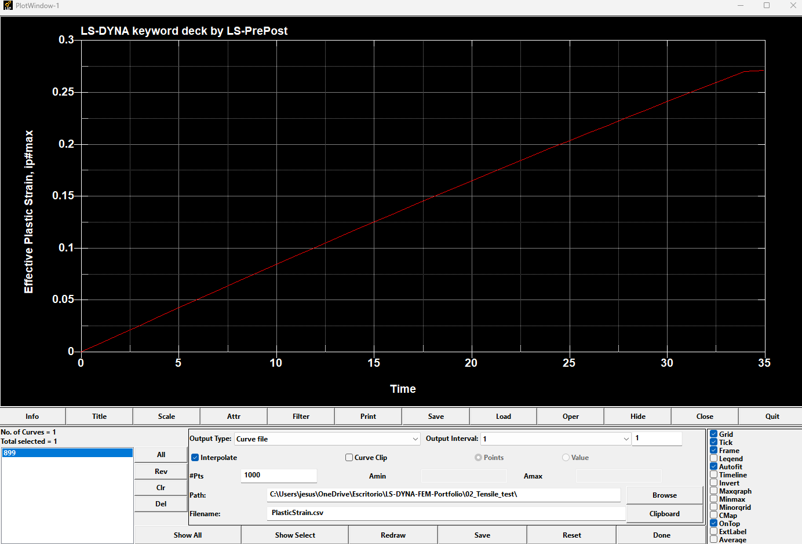
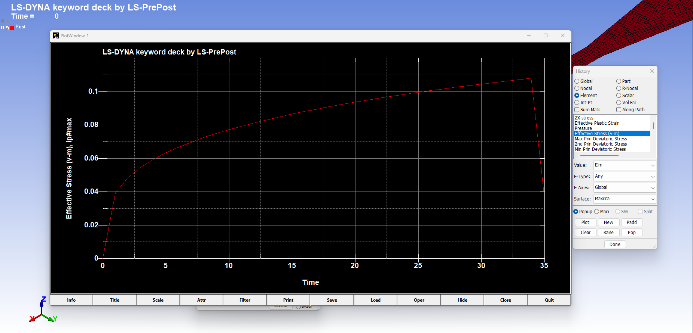
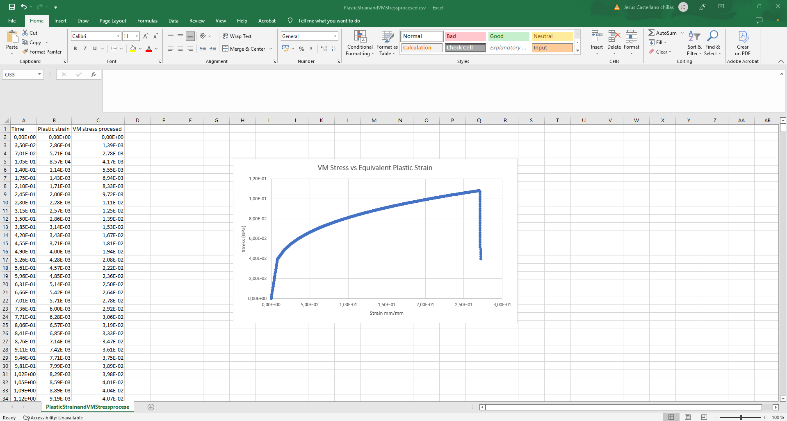

# Exercise 02 — Tensile Test | LS-DYNA

Finite Element simulation of a tensile test performed with **LS-DYNA** and **LS-PrePost**.

The objective of this exercise is to study the nonlinear response of an aluminium tensile specimen, including elastic behaviour, plastic deformation, strain hardening and material failure using `*MAT_PIECEWISE_LINEAR_PLASTICITY` (`*MAT_024`).

The complete workflow includes geometry import, shell meshing, material definition, boundary conditions, prescribed motion, explicit simulation and post-processing of local stress and plastic-strain histories.

---

## 🎯 Objectives

The main objectives of this exercise are:

- Build a tensile-test finite element model in LS-PrePost.
- Work with shell elements and understand their formulation.
- Define a nonlinear material using `*MAT_024`.
- Import a tabulated stress–plastic strain curve.
- Apply displacement-rate loading through prescribed velocity.
- Define appropriate constraints using node sets.
- Simulate plastic deformation and material failure.
- Analyse Effective Plastic Strain and von Mises Effective Stress.
- Export LS-PrePost history data to CSV.
- Process simulation results in Excel.
- Generate a local stress–plastic strain curve for a selected finite element.

---

## 🔧 Model

The specimen geometry was imported into LS-PrePost from an external IGES tensile-test specimen and subsequently meshed using shell elements.

The final FE model uses:

- `*SECTION_SHELL`
- `ELFORM = 2`
- Shell thickness = **2.0 mm**
- `SHRF = 0.8333333`
- `NIP = 2`

The complete LS-DYNA keyword model is available here:

➡️ [02_Tensile_test.k](model/02_Tensile_test.k)

---

## 🧱 Material Model

The specimen is modelled as:

**Aluminium Pure 99.45-O Condition**

using:

`*MAT_PIECEWISE_LINEAR_PLASTICITY` (`*MAT_024`)

Main parameters:

| Parameter | Value |
|---|---:|
| Density, RO | 2.713E-06 kg/mm³ |
| Young's Modulus, E | 68.948 GPa |
| Poisson's Ratio, PR | 0.33 |
| Initial Yield Stress, SIGY | 0.013362 GPa |
| Tangent Modulus, ETAN | 0 |
| Failure Plastic Strain, FAIL | 0.2723 |
| Stress–strain curve, LCSS | 1 |

Plastic hardening is defined through a tabulated stress–plastic strain curve using `*DEFINE_CURVE`.

The processed curve used during model preparation is included here:

➡️ [StressStrain.csv](model/StressStrain.csv)

The original material data source is documented in the [Sources](sources/) section.

---

## 📌 Boundary Conditions

Two node sets were created at the ends of the tensile specimen.

### Fixed end

The left side of the specimen is fully constrained using:

`*BOUNDARY_SPC_SET`

All translational and rotational degrees of freedom are restrained.

### Moving end

The right side is subjected to prescribed motion in the global X direction using:

`*BOUNDARY_PRESCRIBED_MOTION_SET`

with:

- `DOF = 1`
- `VAD = 0` — velocity
- `LCID = 2`
- Velocity = **0.5 mm/ms**

The remaining degrees of freedom of the moving edge are constrained so that the specimen is loaded only along its longitudinal direction.

---

## ⏱️ Simulation Setup

The simulation termination time is:

**35 ms**

using:

`*CONTROL_TERMINATION`

Binary results are generated using:

`*DATABASE_BINARY_D3PLOT`

with:

**DT = 1.0 ms**

Large binary `d3plot` output files are intentionally not included in this repository because they can be regenerated by running the supplied `.k` model.

---

# 📊 Results

## 1. Effective Plastic Strain


Plastic deformation localizes in the reduced gauge section of the specimen.

At the final simulation state, the maximum Effective Plastic Strain reaches approximately:

**εp,max ≈ 0.2723**

This is consistent with the failure value defined in `*MAT_024`:

**FAIL = 0.2723**

The simulation therefore reproduces localization and final failure of the tensile specimen.

---

## 2. Effective Plastic Strain vs Time

A local history was extracted from **Element 899**.



The Effective Plastic Strain increases progressively as irreversible plastic deformation accumulates in the selected element.

The exported data are available here:

➡️ [PlasticStrain.csv](results/PlasticStrain.csv)

---

## 3. Effective von Mises Stress vs Time

The von Mises effective stress history was extracted from the **same Element 899**.



Using the same element for both histories is important because stress and plastic strain are local finite-element quantities.

The stress increases during plastic hardening until the element approaches failure, after which a sharp stress drop is observed.

Exported data:

➡️ [VMStress.csv](results/VMStress.csv)

---

## 4. Effective von Mises Stress vs Effective Plastic Strain

The two histories were combined using their common time values.

This allows time to be removed from the final representation and the local relationship between Effective von Mises Stress and Effective Plastic Strain to be visualised directly.



The curve shows:

1. Plastic yielding.
2. Progressive strain hardening.
3. Increasing accumulated plastic deformation.
4. Approach to the defined failure strain.
5. Rapid loss of stress-carrying capacity during failure.

The processed dataset is available here:

➡️ [Processed Stress–Plastic Strain Data](results/PlasticStrain_VMStress_processed.csv)

> **Important:** This curve represents the local response of **Element 899**. It should not be interpreted as the global engineering stress–strain curve of the complete tensile specimen.

---

# 📘 Step-by-Step Tutorials

Two detailed tutorials document the complete exercise.

### Model Setup Tutorial

Covers:

- IGES geometry import
- Shell meshing
- `*SECTION_SHELL`
- `*MAT_024`
- Material curve import
- Node sets
- Boundary conditions
- Prescribed velocity
- D3PLOT output
- Termination control
- LS-DYNA execution

➡️ [Download Model Setup Tutorial](tutorials/Tutorial_02_Tensile_Test_LS-DYNA.docx)

### Post-processing & Results Tutorial

Covers:

- Effective Plastic Strain contours
- Element-history extraction
- Effective Plastic Strain vs Time
- Effective von Mises Stress vs Time
- CSV export
- Excel scientific-notation processing
- Stress vs Effective Plastic Strain
- Failure interpretation

➡️ [Download Post-processing & Results Tutorial](tutorials/Tutorial_Resultados_02_Ensayo_Traccion_LS-DYNA_ES.docx)

---

# 📂 Repository Structure

```text
02_Tensile_test/
│
├── README.md
│
├── model/
│   ├── 02_Tensile_test.k
│   └── StressStrain.csv
│
├── results/
│   ├── PlasticStrain.csv
│   ├── VMStress.csv
│   └── PlasticStrain_VMStress_processed.csv
│
├── images/
│   ├── 01_effective_plastic_strain.png
│   ├── 02_effective_plastic_strain_vs_time.png
│   ├── 03_vm_stress_vs_time.png
│   └── 04_vm_stress_vs_plastic_strain.png
│
├── tutorials/
│   ├── Tutorial_02_Tensile_Test_LS-DYNA.docx
│   └── Tutorial_Resultados_02_Ensayo_Traccion_LS-DYNA_ES.docx
│
└── sources/
    └── README.md
```

---

# 📚 External Sources

The original CAD geometry and material database are not redistributed directly in this repository.

The sources and instructions required to obtain them are documented here:

➡️ [External Sources and References](sources/README.md)

The model supplied in `model/02_Tensile_test.k` already contains the material definition and curves required to reproduce the LS-DYNA simulation.

---

# 🧠 Main Learning Outcomes

This exercise provided practical experience with:

- Nonlinear finite element analysis.
- Shell-element modelling.
- Piecewise linear plasticity.
- Tabulated material curves.
- Plastic strain accumulation.
- Material failure and element deletion.
- Prescribed-motion boundary conditions.
- LS-DYNA binary result processing.
- Element-level history extraction.
- Scientific-data processing using CSV and Excel.
- Interpretation of local stress–plastic strain behaviour.

---

## Software

- **LS-DYNA**
- **LS-PrePost**
- **Microsoft Excel**

---

## Disclaimer

This project was developed for **educational and portfolio purposes**.

The model is intended to demonstrate LS-DYNA modelling and post-processing workflows. It should not be used directly for engineering design, certification or safety-critical calculations without appropriate verification and validation.